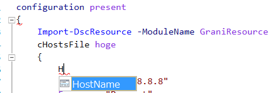

Grani_HostsFile
============

DSC Resource to configure hosts Entry.

Resource Information
----

Name | FriendlyName | ModuleName 
-----|-----|-----
Grani_HostsFile | cHostsFile | GraniResource

Test Status
----

See GraniResource.Test for the detail.

Method | Result
----|----
Pester| pass
Configuration| pass
Get-DSCConfiguration| pass
Test-DSCConfiguration| pass

Intellisense
----



Sample
----

- Add RegistryKey

this will add hosts Entry to resolve google.com as 8.8.8.8

```powershell
configuration present
{
    Import-DscResource -ModuleName GraniResource
    cHostsFile hoge
    {
        HostName = "google.com"
        IpAddress = "8.8.8.8"
        Ensure = "Present"
    }    
}
```

- Remove RegistryKey

this will remove fuga/nyao subkey only. parent subkey tree will remain.

```powershell
configuration Absent
{
    Import-DscResource -ModuleName GraniResource
    cHostsFile hoge
    {
        HostName = "google.com"
        IpAddress = "8.8.8.8"
        Ensure = "Absent"
    }    
}
```
