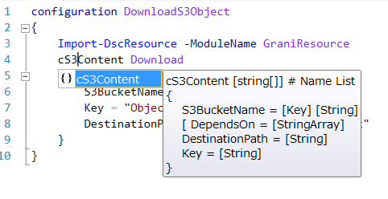

Grani_S3Content
============

DSC Resource to download content from S3.

Resource Information
----

Name | FriendlyName | ModuleName 
-----|-----|-----
Grani_S3Content | cS3Content | GraniResource

Test Status
----

See GraniResource.Test for the detail.

Method | Result
----|----
Pester| pass
Configuration| pass
Get-DSCConfiguration| pass
Test-DSCConfiguration| pass

Intellisense
----



Sample
----

- Download S3Object from Desired S3Bucket.

You may use it for code or any string items.

```powershell
configuration DownloadS3Object
{
    Import-DscResource -ModuleName GraniResource
    cS3Content Download
    {
        S3BucketName = "YourBucketName"
        Key = "ObjectName"
        DestinationPath = "c:\Path\To\Save\Content"
    }
}
```
