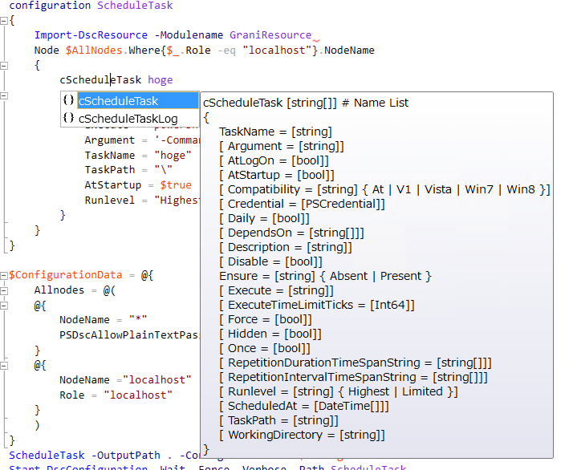

Grani_ScheduleTask
============

DSC Resource to configure Schedule Task.

Resource Information
----

Name | FriendlyName | ModuleName 
-----|-----|-----
Grani_ScheduleTask | cScheduleTask | GraniResource

Test Status
----

See GraniResource.Test for the detail.

Method | Result
----|----
Pester| not yet
Configuration| pass
Get-DSCConfiguration| pass
Test-DSCConfiguration| pass

Intellisense
----



Sample
----

- Create ScheduleTask with SYSTEM account.

```powershell
configuration ScheduleTask
{
    Import-DscResource -Modulename GraniResource
    Node $AllNodes.Where{$_.Role -eq "localhost"}.NodeName
    {
        cScheduleTask ScheduleTask
        {
            Ensure = "present"
            Execute = "powershell.exe"
            Argument = '-Command "Get-Date | Out-File c:\hoge.log"'
            TaskName = "hoge"
            TaskPath = "\"
            ScheduledAt = [datetime]"00:00:00"
            Daily = $true
            Compatibility = "Win8"
        }
    }
}

$ConfigurationData = @{
    Allnodes = @(
        @{
            NodeName = "*"
            PSDscAllowPlainTextPassword = $true
        }
        @{
            NodeName ="localhost"
            Role = "localhost"
        }
    )
}
```

Tips
----

**Work on specific user**

Defaul of Resource creating schedule task user is SYSTEM.

If you want to run Schedule Task as a specific user, then pass ```Credential``` to the configuration. Resource will try to create Schedule task by passed credential.
