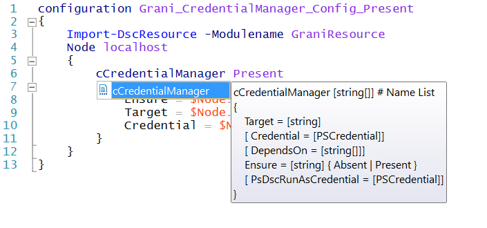

Grani_CredentialManager
============

DSC Resource to manage Credential Manager.

Resource Information
----

Name | FriendlyName | ModuleName 
-----|-----|-----
Grani_CredentialManager | cCredentialManager | GraniResource

Test Status
----

See **Test** Project for the detail.

Method | Result
----|----
Pester| pass
Configuration| pass
Get-DSCConfiguration| pass
Test-DSCConfiguration| pass

Intellisense
----




Sample
----

### Sample 1. Create Credential Manager entry **DesiredTargetName** to DSC run account (== SYSTEM Account).

```powershell
configuration Present_System
{
    Import-DscResource -Modulename GraniResource
    Node localhost
    {
        cCredentialManager Present
        {
            InstanceIdentifier = $Node.InstanceIdentifier
            Ensure = $Node.Ensure
            Target = $Node.Target
            Credential = $Node.Credential
        }
    }
}

$configurationData = @{
    AllNodes = @(
        @{
            NodeName = "localhost"
            PSDscAllowPlainTextPassword = $true
            InstanceIdentifier = "JustAnIdentifierToKeepUnique"
            Ensure = "Present"
            Target = "DesiredTargetName"
            Credential = New-Object PSCredential ("PesterTestDummy", ("PesterTestPassword" | ConvertTo-SecureString -Force -AsPlainText))
        }
    )
}

Present_System -ConfigurationData $configurationData
```

### Sample 2. Remove Credential Manager entry **DesiredTargetName** from DSC run account (== SYSTEM Account).

```powershell
configuration Absent_System
{
    Import-DscResource -Modulename GraniResource
    Node localhost
    {
        cCredentialManager Absent
        {
            InstanceIdentifier = $Node.InstanceIdentifier
            Ensure = $Node.Ensure
            Target = $Node.Target
        }
    }
}

$configurationData = @{
    AllNodes = @(
        @{
            NodeName = "localhost"
            PSDscAllowPlainTextPassword = $true
            InstanceIdentifier = "JustAnIdentifierToKeepUnique"
            Ensure = "Absent"
            Target = "DesiredTargetName"
        }
    )
}

Absent_System -ConfigurationData $configurationData
```

Tips
----

You can handle which user to be target by using PsDscRunAsCredential.

PsDscRunAsCredential functionality is supports from WMF5, so WMF4 users could not handle this behavior.

### Sample3. Create Credential Manager entry **DesiredTargetName** to Specific user account by using PsDscRunAsCredential (== In this case **administrator**).

```powershell
configuration Present_PsDscRunAsCredential
{
    Import-DscResource -Modulename GraniResource
    Node localhost
    {
        cCredentialManager Present
        {
            InstanceIdentifier = $Node.InstanceIdentifier
            Ensure = $Node.Ensure
            Target = $Node.Target
            Credential = $Node.Credential
            PsDscRunAsCredential = $Node.PsDscRunAsCredential
        }
    }
}

$configurationData = @{
    AllNodes = @(
        @{
            NodeName = "localhost"
            PSDscAllowPlainTextPassword = $true
            InstanceIdentifier = "JustAnIdentifierToKeepUnique"
            Ensure = "Present"
            Target = "DesiredTargetName"
            Credential = New-Object PSCredential ("PesterTestDummy", ("PesterTestPassword" | ConvertTo-SecureString -Force -AsPlainText))
            PsDscRunAsCredential = New-Object PSCredential ("administrator", ("SuperExcellntPassword____????1111" | ConvertTo-SecureString -Force -AsPlainText))
        }
    )
}

Present_PsDscRunAsCredential -ConfigurationData $configurationData
```

### Sample4. Remove Credential Manager entry **DesiredTargetName** from Specific user account by using PsDscRunAsCredential (== In this case **administrator**).

```powershell
configuration Absent_PsDscRunAsCredential
{
    Import-DscResource -Modulename GraniResource
    Node localhost
    {
        cCredentialManager Absent
        {
            InstanceIdentifier = $Node.InstanceIdentifier
            Ensure = $Node.Ensure
            Target = $Node.Target
            PsDscRunAsCredential = $Node.PsDscRunAsCredential
        }
    }
}

$configurationData = @{
    AllNodes = @(
        @{
            NodeName = "localhost"
            PSDscAllowPlainTextPassword = $true
            InstanceIdentifier = "JustAnIdentifierToKeepUnique"
            Ensure = "Absent"
            Target = "DesiredTargetName"
            PsDscRunAsCredential = New-Object PSCredential ("administrator", ("SuperExcellntPassword____????1111" | ConvertTo-SecureString -Force -AsPlainText))
        }
    )
}

Absent_PsDscRunAsCredential -ConfigurationData $configurationData
```

### Sample5. Create Credential Manager entry **DesiredTargetName** to Multiple user account by using PsDscRunAsCredential (== In this case **administrator**).

**InstanceIdentifier** is just an identifier to avoid DSC detect duplicate resource for Same **Target**, **Credential** is trying to set to multuple account.

This means you can set any value and never effects to Cred Manager for **InstanceIdentifier**. Just be careful to be unique like following. 

```powershell
configuration Present_MultpleSameTarget
{
    Import-DscResource -Modulename GraniResource
    Node localhost
    {
        cCredentialManager System
        {
            InstanceIdentifier = "Sytem"
            Ensure = $Node.Ensure
            Target = $Node.Target
            Credential = $Node.Credential
        }

        cCredentialManager User
        {
            InstanceIdentifier = "User"
            Ensure = $Node.Ensure
            Target = $Node.Target
            Credential = $Node.Credential
            PsDscRunAsCredential = $Node.PsDscRunAsCredential
        }
    }
}

$configurationData = @{
    AllNodes = @(
        @{
            NodeName = "localhost"
            PSDscAllowPlainTextPassword = $true
            Ensure = "Present"
            Target = "DesiredTargetName"
            Credential = New-Object PSCredential ("PesterTestDummy", ("PesterTestPassword" | ConvertTo-SecureString -Force -AsPlainText))
            PsDscRunAsCredential = New-Object PSCredential ("administrator", ("SuperExcellntPassword____????1111" | ConvertTo-SecureString -Force -AsPlainText))
        }
    )
}

Present_MultpleSameTarget -ConfigurationData $configurationData
```

