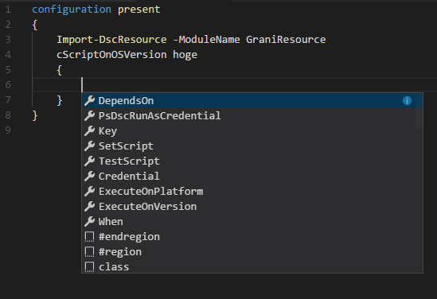

Grani_ScriptOnOSVersion
============

DSC Resource to run Script by each OSVersion

Resource Information
----

Name | FriendlyName | ModuleName
-----|-----|-----
Grani_ScriptOnOSVersion | cScriptOnOSVersion | GraniResource

Test Status
----

See **Test** Project for the detail.

Method | Result
----|----
Pester| pass
Configuration| pass
Get-DSCConfiguration| pass
Test-DSCConfiguration| pass

Intellisense
----



Sample
----

- Run Script to write EnvironmentVariables only when equal to "Windows 10.0.16299.0""

```powershell
configuration present
{
    Import-DscResource -ModuleName GraniResource
    cScriptOnOSVersion ScriptOnOSVersion
    {
        Key = "ScriptOnOSVersion"
        SetScript = {Set-Item -Path Env:Grani_ScriptOnOSVersion -Value 1}
        TestScript = {(Test-Path Env:Grani_ScriptOnOSVersion) -and (Get-Item -Path Env:Grani_ScriptOnOSVersion).Value -eq 1}
        ExecuteOnPlatform = "Win32NT"
        ExecuteOnVersion = "10.0.16299.0"
        When = 'Equal'
    }
}
```
